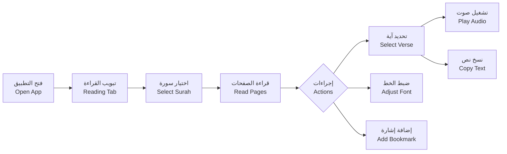
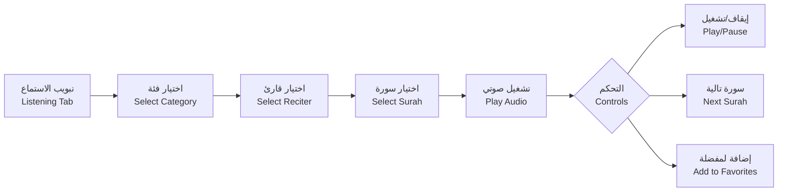
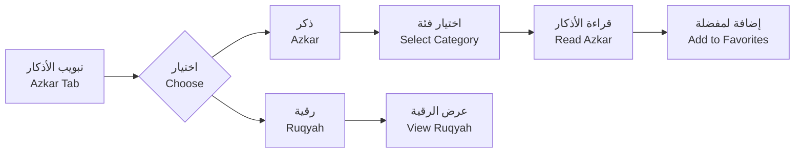

# Althaqafy App - تطبيق الثقفي

<div align="center">


**مكتبة إسلامية شاملة للقرآن الكريم والأذكار والكتب الإسلامية**

**A Comprehensive Islamic Library for Quran, Azkar, and Islamic Books**

[](https://flutter.dev)
[](https://dart.dev)
[]()

</div>

---

## 📖 نظرة عامة | Overview

### العربية

**تطبيق الثقفي** هو تطبيق إسلامي شامل مصمم لتسهيل قراءة القرآن الكريم والاستماع إليه، مع توفير الأذكار والرقية الشرعية ومكتبة من الكتب الإسلامية. التطبيق مطور بواسطة Flutter ويعمل على أنظمة Android و iOS.

**المميزات الرئيسية:**
- قراءة القرآن الكريم بخط عثماني أصيل (604 صفحة)
- الاستماع للقرآن الكريم بأصوات أكثر من 10+ قارئ
- مكتبة شاملة للأذكار والرقية الشرعية
- تشغيل الصوت في الخلفية مع إشعارات التحكم
- نظام المفضلات والإشارات المرجعية
- البحث المتقدم في القرآن والأذكار
- دعم كامل للغة العربية 
### English

**Althaqafy App** is a comprehensive Islamic application designed to facilitate reading and listening to the Holy Quran, along with providing Azkar (remembrances), Ruqyah (Islamic healing), and a library of Islamic books. Developed with Flutter, it works on both Android and iOS platforms.

**Key Features:**
- Read the Holy Quran in authentic Uthmanic script (604 pages)
- Listen to Quran recitations from over 100 reciters
- Comprehensive library of Azkar and Ruqyah
- Background audio playback with media notifications
- Favorites and bookmarking system
- Advanced search in Quran and Azkar
- Full Arabic language support with RTL layout

---

## ✨ المميزات التفصيلية | Detailed Features

### 1. قراءة القرآن الكريم | Quran Reading

#### العربية
- **عرض مطابق للمصحف**: 604 صفحة بالترتيب التقليدي للمصحف الشريف
- **خطوط عربية أصيلة**: خط عثماني، أميري، والقاهرة
- **التنقل السلس**: التمرير السريع بين الصفحات مع منع التجاوز
- **تحديد الآيات**: الضغط المطول لتحديد آية واستعراض الخيارات
- **إجراءات الآيات**:
  - تشغيل تلاوة الآية صوتياً
  - نسخ النص إلى الحافظة
  - عرض التفسير (قيد التطوير)
- **تخصيص حجم الخط**: ضبط حجم الخط من 15-60 بكسل مع معاينة فورية
- **نظام الإشارات المرجعية**: حفظ الصفحات المفضلة للوصول السريع
- **البحث**: البحث في النص القرآني
- **معلومات السور**: اسم السورة، مكان النزول، عدد الآيات
- **مؤشرات التنقل**: رقم الجزء والحزب والصفحة
- **عرض البسملة**: عرض خاص للبسملة بتنسيق ذهبي جميل

#### English
- **Mushaf-Authentic Layout**: 604 pages in traditional Quran page order
- **Authentic Arabic Fonts**: Uthmanic, Amiri, and Cairo fonts
- **Smooth Navigation**: Swipe between pages with overscroll prevention
- **Verse Selection**: Long-press verses to select and view options
- **Verse Actions**:
  - Play verse audio recitation
  - Copy text to clipboard
  - View Tafseer (interpretation - in development)
- **Font Size Customization**: Adjust font size from 15-60 pixels with live preview
- **Bookmarking System**: Save favorite pages for quick access
- **Search**: Search through Quranic text
- **Surah Information**: Name, revelation place, verse count
- **Navigation Indicators**: Juz, Hizb, and page numbers
- **Basmala Display**: Beautiful golden-styled Bismillah rendering

---

### 2. الاستماع للقرآن | Quran Listening

#### العربية
- **14 فئة تلاوة**: مرتل، مجود، ورش، شعبة، والمزيد
- **أكثر من 10+ قارئ**: مكتبة واسعة من القراء المشهورين
- **التشغيل في الخلفية**: الاستمرار في التشغيل عند تصغير التطبيق
- **إشعارات MediaStyle**: التحكم في التشغيل من قفل الشاشة
- **قوائم التشغيل التلقائية**: 114 سورة لكل قارئ
- **عناصر التحكم المتقدمة**:
  - تشغيل/إيقاف مؤقت
  - التقديم والترجيع السريع
  - الانتقال للسورة التالية/السابقة
  - شريط التقدم القابل للسحب
- **نظام المفضلات**: حفظ السور المفضلة لكل قارئ
- **الدعم غير المتصل**: تحميل الملفات الصوتية للاستماع دون إنترنت
- **البحث**: البحث في أسماء القراء والسور
- **مراقبة الاتصال**: التحقق من الإنترنت قبل البث

#### English
- **14 Recitation Categories**: Murattal, Mugawwad, Warsh, Sho3ba, and more
- **10+ Reciters**: Extensive library of renowned reciters
- **Background Playback**: Continue playing when app is minimized
- **MediaStyle Notifications**: Control playback from lock screen
- **Automatic Playlists**: 114 surahs for each reciter
- **Advanced Controls**:
  - Play/Pause
  - Fast forward/rewind
  - Next/Previous surah navigation
  - Seekable progress bar
- **Favorites System**: Save favorite surahs per reciter
- **Offline Support**: Download audio files for offline listening
- **Search**: Search through reciter names and surahs
- **Connectivity Monitoring**: Checks internet before streaming

---

### 3. الأذكار والرقية | Azkar and Ruqyah

#### العربية
- **تبويبات منظمة**: 
  - تبويب "ذكر" للأذكار اليومية
  - تبويب "الرقية" للرقية الشرعية
- **فئات متنوعة**: أذكار الصباح، المساء، النوم، الاستيقاظ، والمزيد
- **نظام المفضلات**: حفظ الأذكار المفضلة للوصول السريع
- **البحث**: البحث في نصوص الأذكار والرقية
- **عرض جميل**: تصميم واضح وسهل القراءة
- **عداد التكرار**: تتبع عدد مرات التكرار لكل ذكر
- **مصادر موثوقة**: أذكار من القرآن والسنة النبوية الصحيحة

#### English
- **Organized Tabs**:
  - "Azkar" tab for daily remembrances
  - "Ruqyah" tab for Islamic healing
- **Various Categories**: Morning, evening, sleep, waking, and more
- **Favorites System**: Save favorite azkar for quick access
- **Search**: Search through Azkar and Ruqyah texts
- **Beautiful Display**: Clear and easy-to-read design
- **Repetition Counter**: Track repetition count for each zikr
- **Authentic Sources**: Azkar from Quran and authentic Sunnah

---

### 4. مكتبة الكتب | Books Library

#### العربية
- **كتب الدكتور سالم الثقفي**: مجموعة من الكتب الإسلامية
- **عرض منظم**: عرض الكتب في شبكة منظمة
- **البحث**: البحث في عناوين الكتب
- **واجهة سهلة**: تصفح سهل وسريع للكتب

#### English
- **Dr. Salem Al-Thaqafi's Books**: Collection of Islamic books
- **Organized Display**: Books displayed in organized grid
- **Search**: Search through book titles
- **Easy Interface**: Simple and fast book browsing

---

### 5. التواصل | Contact

#### العربية
- **معلومات المؤلف**: عرض السيرة الذاتية للدكتور سالم الثقفي
- **الشهادات**: عرض الشهادات العلمية
- **وسائل التواصل**: روابط مباشرة للتواصل

#### English
- **Author Information**: Display Dr. Salem Al-Thaqafi's biography
- **Certificates**: Academic credentials display
- **Contact Methods**: Direct contact links

---

## 🏗️ البنية التقنية | Technical Architecture

### Structure | البنية

```
lib/
├── main.dart                    # نقطة الدخول الرئيسية | Main entry point
├── constants.dart               # الثوابت والألوان | Constants and colors
├── pages/                       # الصفحات الرئيسية | Main pages
│   ├── main_navigation.dart     # التنقل السفلي | Bottom navigation
│   ├── quran_pages/             # صفحات القرآن | Quran pages
│   │   ├── quran_reading_main_page.dart
│   │   ├── listening_page/      # صفحات الاستماع | Listening pages
│   │   └── book_mark_provider.dart
│   ├── azkar_pages/             # صفحات الأذكار | Azkar pages
│   │   ├── azkar_main_page.dart
│   │   ├── zekr_page.dart
│   │   └── fav_azkar_page.dart
│   ├── ruqiya_pages/            # صفحات الرقية | Ruqyah pages
│   └── books/                   # صفحات الكتب | Books pages
├── widgets/                     # المكونات المعاد استخدامها | Reusable widgets
├── cubit/                       # إدارة الحالة BLoC | BLoC state management
├── model/                       # نماذج البيانات | Data models
├── services/                    # الخدمات | Services
│   └── audio_handler.dart       # معالج الصوت | Audio handler
├── utils/                       # الأدوات المساعدة | Utilities
└── database_helper.dart         # قاعدة البيانات | Database helper
```

### State Management | إدارة الحالة

#### العربية
- **BLoC Pattern**: إدارة حالة الأذكار والمفضلات
  - `AzkarCubit`: تحميل وإدارة الأذكار
  - `RuqiyaCubit`: تحميل وإدارة الرقية
  - `FavZekrCubit`: إدارة الأذكار المفضلة
  - `FavSurahItemCubit`: إدارة السور المفضلة
- **Provider Pattern**: إدارة حالة القرآن
  - `QuranDataProvider`: بيانات القرآن
  - `QuranFontSizeProvider`: حجم الخط
  - `BookmarkProvider`: الإشارات المرجعية
  - `BookProvider`: إدارة الكتب

#### English
- **BLoC Pattern**: Azkar and favorites state management
  - `AzkarCubit`: Load and manage azkar
  - `RuqiyaCubit`: Load and manage ruqyah
  - `FavZekrCubit`: Manage favorite azkar
  - `FavSurahItemCubit`: Manage favorite surahs
- **Provider Pattern**: Quran state management
  - `QuranDataProvider`: Quran data
  - `QuranFontSizeProvider`: Font size
  - `BookmarkProvider`: Bookmarks
  - `BookProvider`: Books management

---

## 📦 التقنيات المستخدمة | Technologies Used

### Core Dependencies | التبعيات الأساسية

#### Audio & Media | الصوت والوسائط
```yaml
audio_service: ^0.18.18        # خدمة الصوت في الخلفية | Background audio service
just_audio: ^0.10.5             # مشغل صوت متقدم | Advanced audio player
audioplayers: ^6.5.1            # مشغل صوت بديل | Alternative audio player
```

#### Quran Data | بيانات القرآن
```yaml
quran: ^1.4.1                   # بيانات القرآن والآيات | Quran data and verses
al_quran: ^0.1.1+5              # بيانات قرآنية إضافية | Additional Quran data
```

#### State Management | إدارة الحالة
```yaml
flutter_bloc: ^9.1.1            # نمط BLoC | BLoC pattern
provider: ^6.1.5+1              # نمط Provider | Provider pattern
equatable: ^2.0.7               # مقارنة الكائنات | Object comparison
```

#### Database & Storage | قاعدة البيانات والتخزين
```yaml
sqflite: ^2.4.2                 # قاعدة بيانات SQLite | SQLite database
shared_preferences: ^2.5.3      # تخزين تفضيلات المستخدم | User preferences storage
path_provider: ^2.1.5           # مسارات النظام | System paths
hive: ^2.2.3                    # قاعدة بيانات NoSQL | NoSQL database
```

#### Network & Connectivity | الشبكة والاتصال
```yaml
dio: ^5.9.0                     # عميل HTTP | HTTP client
http: ^1.6.0                    # طلبات HTTP | HTTP requests
connectivity_plus: ^7.0.0       # مراقبة الاتصال | Connectivity monitoring
```

#### UI Components | مكونات واجهة المستخدم
```yaml
animated_notch_bottom_bar: ^1.0.3  # شريط تنقل سفلي | Bottom navigation bar
flutter_svg: ^2.2.3                # رسومات SVG | SVG graphics
shimmer: ^3.0.0                    # تأثير التحميل | Loading shimmer effect
modal_progress_hud_nsn: ^0.5.1     # مؤشر التقدم | Progress indicator
```

#### Utilities | الأدوات المساعدة
```yaml
share_plus: ^12.0.1             # مشاركة المحتوى | Content sharing
url_launcher: ^6.3.2            # فتح الروابط | URL launching
fluttertoast: ^9.0.0            # رسائل التنبيه | Toast messages
rxdart: ^0.28.0                 # برمجة تفاعلية | Reactive programming
```

#### Localization | الترجمة
```yaml
flutter_localization: ^0.3.3    # دعم اللغات | Language support
flutter_localizations: sdk      # ترجمات Flutter | Flutter translations
```

---

## 🔄 سير العمل | Workflow

### User Journey | رحلة المستخدم

#### 1. قراءة القرآن | Quran Reading


#### 2. الاستماع للقرآن | Quran Listening


#### 3. الأذكار | Azkar


---

## 💾 قاعدة البيانات | Database Schema

### Tables | الجداول

#### العربية

**1. جدول المفضلات (favorites)**
```sql
CREATE TABLE favorites (
  id INTEGER PRIMARY KEY AUTOINCREMENT,
  surahIndex INTEGER NOT NULL,      -- رقم السورة
  reciterName TEXT NOT NULL,         -- اسم القارئ
  url TEXT NOT NULL,                 -- رابط الملف الصوتي
  createdAt TIMESTAMP DEFAULT CURRENT_TIMESTAMP
);
```

**2. جدول الإشارات المرجعية (bookmarks)**
```sql
CREATE TABLE bookmarks (
  id INTEGER PRIMARY KEY AUTOINCREMENT,
  pageNumber INTEGER NOT NULL,       -- رقم الصفحة
  surahName TEXT,                    -- اسم السورة
  createdAt TIMESTAMP DEFAULT CURRENT_TIMESTAMP
);
```

**3. جدول الإعدادات (settings)**
```sql
CREATE TABLE settings (
  key TEXT PRIMARY KEY,              -- مفتاح الإعداد
  value TEXT NOT NULL                -- قيمة الإعداد
);
```

**4. جدول حجم الخط (fontSize)**
```sql
CREATE TABLE fontSize (
  id INTEGER PRIMARY KEY,
  size REAL NOT NULL                 -- حجم الخط (15-60)
);
```

**5. جدول السمة (theme)**
```sql
CREATE TABLE theme (
  id INTEGER PRIMARY KEY,
  isDark INTEGER NOT NULL            -- 0 = فاتح، 1 = داكن
);
```

#### English

**1. Favorites Table**
```sql
CREATE TABLE favorites (
  id INTEGER PRIMARY KEY AUTOINCREMENT,
  surahIndex INTEGER NOT NULL,      -- Surah number
  reciterName TEXT NOT NULL,         -- Reciter name
  url TEXT NOT NULL,                 -- Audio file URL
  createdAt TIMESTAMP DEFAULT CURRENT_TIMESTAMP
);
```

**2. Bookmarks Table**
```sql
CREATE TABLE bookmarks (
  id INTEGER PRIMARY KEY AUTOINCREMENT,
  pageNumber INTEGER NOT NULL,       -- Page number
  surahName TEXT,                    -- Surah name
  createdAt TIMESTAMP DEFAULT CURRENT_TIMESTAMP
);
```

**3. Settings Table**
```sql
CREATE TABLE settings (
  key TEXT PRIMARY KEY,              -- Setting key
  value TEXT NOT NULL                -- Setting value
);
```

**4. Font Size Table**
```sql
CREATE TABLE fontSize (
  id INTEGER PRIMARY KEY,
  size REAL NOT NULL                 -- Font size (15-60)
);
```

**5. Theme Table**
```sql
CREATE TABLE theme (
  id INTEGER PRIMARY KEY,
  isDark INTEGER NOT NULL            -- 0 = Light, 1 = Dark
);
```

---

## 🚀 التثبيت والإعداد | Installation & Setup

### Prerequisites | المتطلبات

#### العربية
- Flutter SDK 3.9.2 أو أحدث
- Dart SDK 3.0 أو أحدث
- Android Studio أو VS Code
- جهاز Android (API 24+) أو iOS (13.0+)

#### English
- Flutter SDK 3.9.2 or higher
- Dart SDK 3.0 or higher
- Android Studio or VS Code
- Android device (API 24+) or iOS (13.0+)

### Installation Steps | خطوات التثبيت

```bash
# 1. Clone the repository | استنساخ المستودع
git clone <repository-url>
cd althaqafy

# 2. Install dependencies | تثبيت التبعيات
flutter pub get

# 3. Run the app | تشغيل التطبيق
flutter run

# 4. Build for production | بناء للإنتاج
# Android
flutter build apk --release
flutter build appbundle --release

# iOS
flutter build ios --release
flutter build ipa --release
```

For detailed build instructions, see [BUILD_INSTRUCTIONS.md](BUILD_INSTRUCTIONS.md)

---

## 📱 منصات الدعم | Supported Platforms

| Platform | Minimum Version | Status |
|----------|----------------|--------|
| Android  | API 24 (Android 7.0) | ✅ Supported |
| iOS      | iOS 13.0 | ✅ Supported |
| Web      | - | ❌ Not Supported |
| Desktop  | - | 🚧 Experimental |

---

## 🎨 السمات والألوان | Themes & Colors

### Color Palette | لوحة الألوان

```dart
// Primary Colors | الألوان الأساسية
kPrimaryColor: #F5E9D4        // بيج فاتح | Light beige
kSecondaryColor: #6a564f      // بني | Brown
kTextColor: #FFFFFF           // أبيض | White

// Accent Colors | الألوان المميزة  
goldColor: #D4AF37            // ذهبي للبسملة | Gold for Basmala
highlightYellow: #FFEB3B      // أصفر للتحديد | Yellow for highlighting
highlightRed: #F44336         // أحمر للنص المحدد | Red for selected text
```

### Fonts | الخطوط

- **Uthmanic Script**: للقرآن الكريم | For Quran text
- **Amiri**: للبسملة | For Basmala
- **Cairo**: للواجهة الرئيسية | For main UI
- **DiodrumArabic**: للعناوين | For headers
- **Rajdhani**: للأرقام | For numbers

---

## 📂 الأصول | Assets

```
assets/
├── images/           # الصور والأيقونات | Images and icons
├── fonts/            # الخطوط العربية | Arabic fonts
├── db/              # قواعد البيانات المحلية | Local databases
│   ├── adhkar.json  # بيانات الأذكار | Azkar data
│   └── ruqiya.json  # بيانات الرقية | Ruqyah data
├── logo.png         # شعار التطبيق | App logo
├── owner.png        # صورة المؤلف | Author photo
└── cert.jpg         # الشهادات | Certificates
```

---

## 🔐 الخصوصية والأمان | Privacy & Security

### Data Collection | جمع البيانات

#### العربية
- **لا يتم جمع بيانات شخصية**: التطبيق لا يجمع أو يخزن معلومات شخصية
- **التخزين المحلي فقط**: جميع البيانات (المفضلات، الإشارات، الإعدادات) تُخزن محلياً على الجهاز
- **لا توجد حسابات مستخدمين**: لا يتطلب التطبيق إنشاء حساب
- **الأذونات المطلوبة**:
  - الإنترنت: لتحميل الملفات الصوتية
  - التخزين: لحفظ الملفات الصوتية المحملة
  - الإشعارات: لعناصر التحكم في الصوت

#### English
- **No Personal Data Collection**: App doesn't collect or store personal information
- **Local Storage Only**: All data (favorites, bookmarks, settings) stored locally on device
- **No User Accounts**: App doesn't require account creation
- **Required Permissions**:
  - Internet: For downloading audio files
  - Storage: For saving downloaded audio files
  - Notifications: For audio playback controls

For full privacy policy, see [PRIVACY_POLICY.md](PRIVACY_POLICY.md)

---

## 🛠️ التطوير | Development

### Running Tests | تشغيل الاختبارات

```bash
# Run all tests | تشغيل جميع الاختبارات
flutter test

# Run with coverage | تشغيل مع التغطية
flutter test --coverage
```

### Code Quality | جودة الكود

```bash
# Analyze code | تحليل الكود
flutter analyze

# Format code | تنسيق الكود
dart format .
```

---

## 📄 الترخيص | License

هذا التطبيق خاص ولا يسمح بإعادة توزيعه أو تعديله دون إذن.

This application is proprietary and may not be redistributed or modified without permission.

---

## 👨‍💻 المطور | Developer

**Dr. Salem Al-Thaqafi - الدكتور سالم الثقفي**

For more information, visit the Contact section in the app.

---

## 📞 الدعم | Support

للإبلاغ عن المشاكل أو طلب ميزات جديدة، يرجى التواصل من خلال قسم "اتصل بنا" في التطبيق.

For bug reports or feature requests, please contact through the "Contact Us" section in the app.

---

## 🙏 شكر وتقدير | Acknowledgments

- **Al-Quran API**: لتوفير بيانات القرآن الكريم | For providing Quran data
- **Quranicaudio.com**: لتوفير التلاوات الصوتية | For providing audio recitations
- **Flutter Team**: لإطار العمل الرائع | For the amazing framework
- **Contributors**: جميع المساهمين في المكتبات مفتوحة المصدر المستخدمة | All contributors to open-source packages used

---

## 📚 وثائق إضافية | Additional Documentation

- [Build Instructions](BUILD_INSTRUCTIONS.md) - تعليمات البناء والنشر
- [Quran Reading Feature](QURAN_READING_README.md) - تفاصيل ميزة القراءة
- [Quran Listening Feature](QURAN_LISTENING_README.md) - تفاصيل ميزة الاستماع
- [Release Summary](RELEASE_SUMMARY.md) - ملخص الإصدار
- [Privacy Policy](PRIVACY_POLICY.md) - سياسة الخصوصية

---

<div align="center">

**صُنع بـ ❤️ للمسلمين في كل مكان**

**Made with ❤️ for Muslims everywhere**

**Version 3.0.0+3**

</div>
